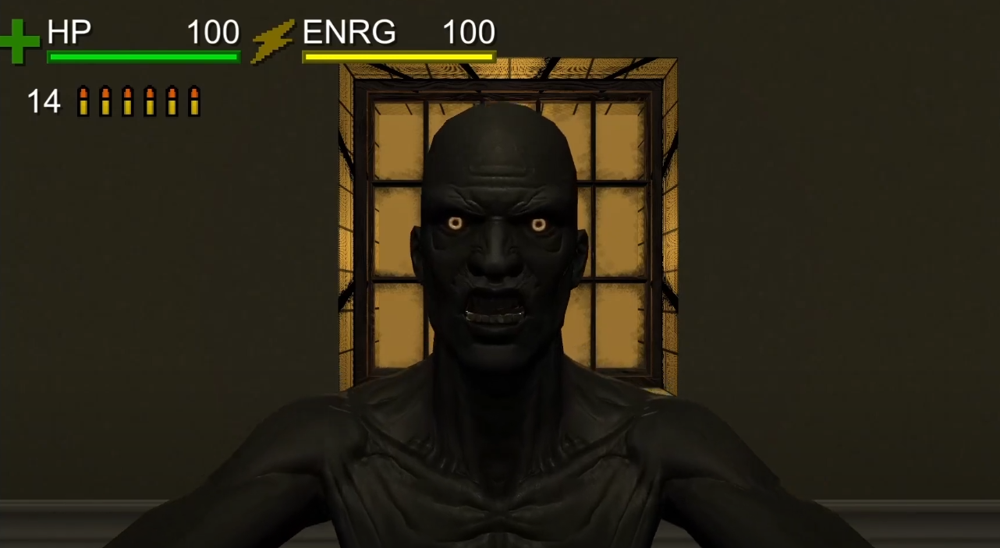
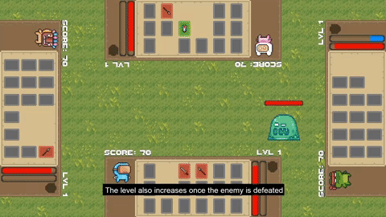
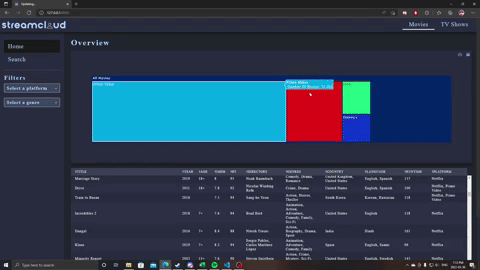
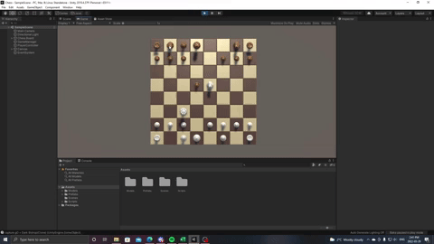

# Projects
This is all the majority of my work done outside and some within my education at MacEwan University.

# Daemon Killer
The project was made over 3 months and was made by myself, Tyson H, and Jacky H. It is a top-down horror game to give an old-school survival horror game feel. You play as a private investigator that is tasked with researching magical fluctuations coming from a mansion. The game plays with a semi-turn-based action system, as you run around avoiding enemies to wait for your turn to take action.

Video demo: https://youtu.be/EEo1gqdZcGs

# Matching Fantasy
Matching Fantasy is a matching game that the Edmonton Public Library now uses on some of their touch tables. The game involves 1-4 players trying to match cards to defeat various enemies to get the highest score possible. It was made by Justin Y, Laroy M, Lou L, and myself. The main game loop involves the players working together to match cards that do specific effects like attacking, defending, healing, and mana recovery.

# StreamCloud
StreamCloud is a project developed over four months by myself and another programmer. StreamCloud displays the number of movies/shows on a streaming platform by visualizing data. It was made to make the users' choice easier when selecting a streaming platform to subscribe to.

# Chess
The project's goal was to re-create chess within the Unity Engine within a week. Through this project, I gained a deeper understanding of OOP and, in general, how Unity functions. All chess pieces work as expected and can take an opponent's piece. However, this project has one caveat: it will not tell you when a player has entered check or in checkmate.

# Marinara Platformer
The goal of this project is for me to learn more about Unreal Engine 4 with only the official documentation. It is a recreation of the classic game Mario Bros as the game’s simple concept helped tackle a somewhat unfamiliar game engine environment. I created all code and blueprints for this project.
Due to the size of the project, I am unable to upload the project to GitHub.

# Game Jams

**Global Game Jam 2022:** World of Darkness: Yomi no Kuni
This game was made over 48 hours for the Global Game Jam 2022. World of Darkness is a rogue where death is not necessarily the end if you die. When you die, you must kill all the enemies you have previously killed in the living world to revive and have another chance at your run. 

Here is a short video demo: https://youtu.be/Bxp2Oh9d3GE

REPO: https://gitlab.com/Rozuo/ggj-2021

Note: The repo says 2021, but that is a typo on the repo. It is 2022.

**Global Game Jam 2020:** Worked on gameplay mechanics involving running around the globe, planting, and growing.
  
  https://gitlab.com/Rozuo/ggj2020-plant-globe
 
 
**Alberta Game Jam Summer 2019:** called Alberta Game Jam, where I led other programmers over source control, Unity, and Ai.
  
  https://plazmatic4.itch.io/into-the-pit
  
  https://gitlab.com/Rozuo/into-the-pit 

  
**Fall Game Jam 2018:** Worked on level functionality and designed levels.
  
  https://kevin-nguyen.itch.io/spoonicide

# Hackthons
**SpaceApps Challenge:**

https://github.com/JustinYeung-source/SpaceAppsChallenge
